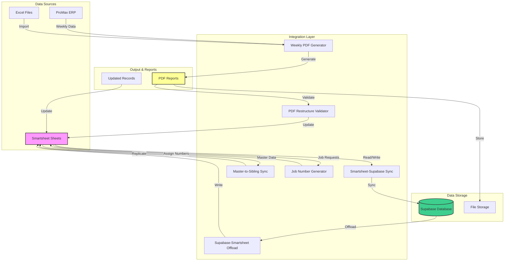

# Welcome to the Smartsheet Integration Suite

  

    <h3>📚 Documentation Hub</h3>
    
Central documentation for all Smartsheet integration repositories, providing comprehensive guides and references.

  

  

    <h3>🔄 Automated Workflows</h3>
    
Seamlessly sync data between Smartsheet, Supabase, and Excel with robust Python and TypeScript integrations.

  

  

    <h3>🛠️ Production Ready</h3>
    
Battle-tested tools for job number generation, PDF reports, and data validation in production environments.

  

## Overview

The Smartsheet Integration Suite is a collection of Python and TypeScript applications designed to automate data synchronization, reporting, and validation workflows for Linetec's business operations. These tools connect Smartsheet with various systems including Supabase databases, ProMax ERP, and custom reporting solutions.

## Technology Stack

## Architecture Overview

The integration suite follows a distributed architecture where each component focuses on a specific business function:

## Quick Start

Ready to get started? Here's what you need to know:

1. **[Master Index](master-index.md)** - Complete catalog of all 6 repositories
2. **[Usage Guide](usage-guide.md)** - Step-by-step setup and configuration
3. **[Smartsheet Integration](smartsheet-integration.md)** - Data flows and mappings
4. **[Watch Out For](watch-out-for.md)** - Critical pitfalls to avoid

## Key Features

- **Bidirectional Sync**: Real-time data synchronization between Smartsheet and Supabase
- **Automated Job Numbering**: Intelligent job number assignment with conflict prevention
- **Weekly Reporting**: Automated PDF generation from ProMax and Excel data
- **Data Validation**: PDF structure validation and CU code verification
- **Master-Sibling Replication**: Automated sheet-to-sheet data copying
- **GitHub Actions Integration**: Scheduled workflows for hands-free operation
- **Error Handling**: Robust retry logic and comprehensive logging
- **Environment Isolation**: Separate configurations for development and production

## Repository Ecosystem

The suite consists of 6 specialized repositories, each handling a specific aspect of the integration workflow:

| Repository | Language | Primary Function | Status |
|-----------|----------|------------------|--------|
| [Supabase Smartsheet Promax Offload](repositories/supabase-smartsheet-promax-offload.md) | Python | Sync from Supabase to Smartsheet | Active |
| [Smartsheet Supabase Sync](repositories/smartsheet-supabase-sync.md) | TypeScript | Sync from Smartsheet to Supabase | Active |
| [Master to Sibling Function](repositories/master-to-sibling-smartsheet-function.md) | Python | Sheet-to-sheet replication | Active |
| [Generate Job Numbers](repositories/generate-job-numbers.md) | Python | Automated job numbering | Active |
| [Generate Weekly PDFs](repositories/generate-weekly-pdfs-dsr-resiliency.md) | Python | Weekly PDF reports | Active |
| [Resiliency PDF Restructure](repositories/resiliency-pdf-restructure-ug-work.md) | Python | PDF validation | Active |

## Getting Help

!!! tip "Need Help?"
    - Check the **[Troubleshooting Guide](troubleshooting.md)** for common issues
    - Review **[Watch Out For](watch-out-for.md)** for critical warnings
    - See **[Maintenance Guide](maintenance-guide.md)** for update procedures

## Contributing

This documentation is maintained alongside the integration repositories. To suggest improvements:

1. Visit the [documentation repository](https://github.com/JFlo21/smartsheet-integration-docs)
2. Open an issue or submit a pull request
3. All pages have an "Edit this page" link in the top right

---

  
<strong>Smartsheet Integration Suite</strong>

  
Built with ❤️ for efficient business operations

