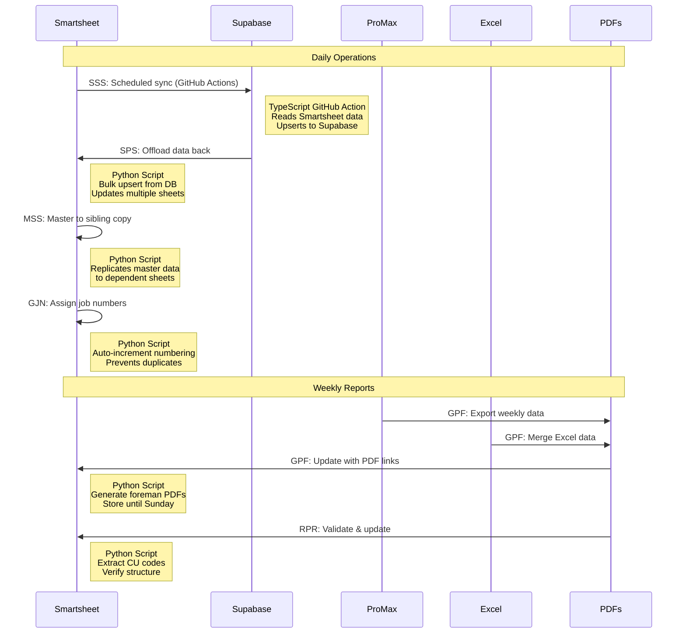

# Master Repository Index

This comprehensive index provides an overview of all Smartsheet integration repositories, their relationships, and data flows.

## Repository Catalog

### Active Repositories

| Repository | Language | Description | GitHub | Last Updated |
|-----------|----------|-------------|--------|--------------|
| **[Supabase Smartsheet Promax Offload](repositories/supabase-smartsheet-promax-offload.md)** | Python 94.7% | Offloads data from Supabase database to Smartsheet sheets. Handles bulk upsert operations with retry logic. | [View Repo](https://github.com/JFlo21/supabase-smartsheet-promax-offload) | 2025 |
| **[Smartsheet Supabase Sync](repositories/smartsheet-supabase-sync.md)** | TypeScript 40.5% | GitHub Actions workflow that syncs data from Smartsheet to Supabase on a schedule. | [View Repo](https://github.com/JFlo21/Smartsheet-supabase-sync) | 2025 |
| **[Master to Sibling Smartsheet](repositories/master-to-sibling-smartsheet-function.md)** | Python 100% | Replicates data from a master Smartsheet to multiple sibling sheets. Maintains data consistency across sheets. | [View Repo](https://github.com/JFlo21/master-to-sibling-smartsheet-function) | 2026 |
| **[Generate Job Numbers](repositories/generate-job-numbers.md)** | Python 100% | Automatically assigns job numbers to Smartsheet rows. Prevents duplicates and handles incremental numbering. | [View Repo](https://github.com/JFlo21/generate-job-numbers) | 2025 |
| **[Generate Weekly PDFs DSR](repositories/generate-weekly-pdfs-dsr-resiliency.md)** | Python 98.9% | Generates weekly PDF reports for each foreman from ProMax data. Integrates Excel data and updates Smartsheet. | [View Repo](https://github.com/JFlo21/Generate-Weekly-PDFs-DSR-Resiliency) | 2025 |
| **[Resiliency PDF Restructure](repositories/resiliency-pdf-restructure-ug-work.md)** | Python 66% | Validates PDF structure and extracts CU codes. Updates Smartsheet with validation results. | [View Repo](https://github.com/JFlo21/Resiliency-pdf-restructure-ug-work) | 2025 |

## Cross-Reference Matrix

This matrix shows the data flow and dependencies between repositories:

| From / To | Supabase | Smartsheet Master | Smartsheet Siblings | PDFs | ProMax |
|-----------|----------|-------------------|---------------------|------|--------|
| **Smartsheet** | ✅ SSS Sync | - | ✅ MSS Copy | - | - |
| **Supabase** | - | ✅ SPS Offload | - | - | - |
| **ProMax ERP** | - | - | - | ✅ GPF Generate | - |
| **Excel Files** | - | - | - | ✅ GPF Process | - |
| **PDF Validator** | - | ✅ RPR Update | - | ⬅️ RPR Read | - |
| **Job Generator** | - | ✅ GJN Assign | - | - | - |

**Legend:**
- ✅ = Active data flow
- ⬅️ = Read operation
- ➡️ = Write operation
- **SSS** = Smartsheet-Supabase-Sync
- **SPS** = Supabase-Smartsheet-Promax-Offload
- **MSS** = Master-to-Sibling-Smartsheet
- **GJN** = Generate-Job-Numbers
- **GPF** = Generate-Weekly-PDFs
- **RPR** = Resiliency-PDF-Restructure

## Integration Flow Diagram

## Repository Quick Access

### By Function

#### Data Synchronization
- **[Smartsheet → Supabase](repositories/smartsheet-supabase-sync.md)** - TypeScript, GitHub Actions, scheduled
- **[Supabase → Smartsheet](repositories/supabase-smartsheet-promax-offload.md)** - Python, bulk operations
- **[Smartsheet → Smartsheet](repositories/master-to-sibling-smartsheet-function.md)** - Python, master-sibling pattern

#### Automation & Processing
- **[Job Numbering](repositories/generate-job-numbers.md)** - Python, auto-increment logic
- **[PDF Generation](repositories/generate-weekly-pdfs-dsr-resiliency.md)** - Python, Excel + ProMax data
- **[PDF Validation](repositories/resiliency-pdf-restructure-ug-work.md)** - Python, structure checking

### By Technology

#### Python Repositories (5)
1. Supabase Smartsheet Promax Offload
2. Master to Sibling Smartsheet Function
3. Generate Job Numbers
4. Generate Weekly PDFs DSR Resiliency
5. Resiliency PDF Restructure UG Work

#### TypeScript Repositories (1)
1. Smartsheet Supabase Sync (GitHub Actions)

## Common Components

### Shared Dependencies

All repositories depend on:

- **Smartsheet API**: Primary data source and destination
- **Environment Variables**: Configuration management via `.env` files
- **API Tokens**: Secure authentication for all services
- **Error Handling**: Robust retry logic and logging

### Common Environment Variables

| Variable | Purpose | Used By |
|----------|---------|---------|
| `SMARTSHEET_ACCESS_TOKEN` | Smartsheet API authentication | All repos |
| `SUPABASE_URL` | Supabase project URL | SSS, SPS |
| `SUPABASE_KEY` | Supabase API key | SSS, SPS |
| `SHEET_ID_*` | Specific sheet identifiers | All repos (varies) |
| `COLUMN_ID_*` | Column identifiers for mapping | All repos (varies) |

!!! warning "Security Notice"
    Never commit API tokens or sensitive credentials to version control. Always use environment variables or secure secret management.

## Update Frequency

| Repository | Execution | Frequency | Trigger |
|-----------|-----------|-----------|---------|
| Smartsheet-Supabase-Sync | GitHub Actions | Daily/Hourly | Scheduled cron |
| Supabase-Smartsheet-Offload | Manual/Scheduled | As needed | Manual or cron |
| Master-to-Sibling | Manual/Triggered | On demand | Webhook or manual |
| Generate-Job-Numbers | Manual/Triggered | On new rows | Webhook or manual |
| Generate-Weekly-PDFs | Scheduled | Weekly (Monday) | Cron job |
| Resiliency-PDF-Restructure | Scheduled | Weekly | After PDF generation |

## Getting Started

To work with these repositories:

1. **Review**: Start with the [Usage Guide](usage-guide.md) for setup instructions
2. **Understand**: Read [Smartsheet Integration](smartsheet-integration.md) for data flows
3. **Be Careful**: Check [Watch Out For](watch-out-for.md) for critical warnings
4. **Maintain**: Follow the [Maintenance Guide](maintenance-guide.md) for updates
5. **Troubleshoot**: Use the [Troubleshooting Guide](troubleshooting.md) when issues arise

## Next Steps

  

    <h3>📖 Read the Guides</h3>
    
Start with the <a href="../usage-guide/">Usage Guide</a> to understand setup and configuration.

  

  

    <h3>🔍 Explore Repositories</h3>
    
Visit the <a href="../repositories/">Repositories section</a> for detailed documentation on each tool.

  

  

    <h3>⚠️ Learn the Pitfalls</h3>
    
Review <a href="../watch-out-for/">Watch Out For</a> to avoid common mistakes.

  

