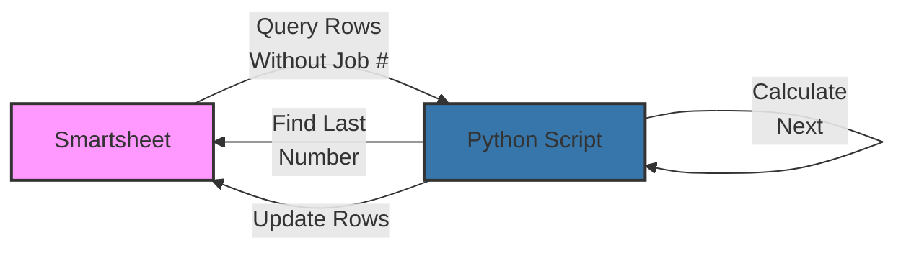

# Generate Job Numbers

<div class="repo-header">
  <h1>Generate Job Numbers</h1>
  <p>Python script that automatically assigns sequential job numbers to Smartsheet rows, with duplicate prevention and configurable starting values.</p>
  <div class="badges">
    <span class="language-badge language-python">Python 100%</span>
    <span class="status-badge status-active">Active</span>
  </div>
</div>

## Overview

Automates the assignment of unique, sequential job numbers to Smartsheet rows. Eliminates manual numbering errors and ensures consistency across your job tracking system.

**GitHub Repository**: [JFlo21/generate-job-numbers](https://github.com/JFlo21/generate-job-numbers)

## Key Features

<div class="feature-list">

- **Auto-Increment**: Automatic sequential numbering
- **Duplicate Prevention**: Ensures unique job numbers
- **Configurable Start**: Set custom starting number
- **Gap Handling**: Fills gaps in number sequence
- **Batch Processing**: Efficient handling of multiple rows
- **Dry-Run Mode**: Test before assigning
- **Webhook Ready**: Can be triggered by Smartsheet webhooks

</div>

## Use Cases

- Assigning job numbers to new projects
- Creating unique identifiers for work orders
- Generating sequential purchase order numbers
- Auto-numbering service requests

## Architecture



## File Structure

```
generate-job-numbers/
├── generate_job_numbers.py  # Main script
├── config.py                 # Configuration
├── requirements.txt          # Dependencies
├── .env.example              # Environment template
└── README.md                 # Documentation
```

## Environment Variables

| Variable | Required | Description | Example |
|----------|----------|-------------|---------|
| `SMARTSHEET_ACCESS_TOKEN` | Yes | API token | `ll...` |
| `SHEET_ID` | Yes | Target sheet ID | `1234567890123456` |
| `COLUMN_ID_JOB_NUMBER` | Yes | Job number column ID | `1234567890123456` |
| `STARTING_NUMBER` | No | First job number (default: 1000) | `1000` |
| `PREFIX` | No | Number prefix | `JOB-` |
| `DRY_RUN` | No | Test mode | `false` |

## Setup Instructions

### 1. Clone Repository

```bash
git clone https://github.com/JFlo21/generate-job-numbers.git
cd generate-job-numbers
```

### 2. Install Dependencies

```bash
python -m venv venv
source venv/bin/activate
pip install -r requirements.txt
```

### 3. Configure Environment

```env
SMARTSHEET_ACCESS_TOKEN=your_token
SHEET_ID=1234567890123456
COLUMN_ID_JOB_NUMBER=1111111111111111
STARTING_NUMBER=1000
PREFIX=JOB-
DRY_RUN=false
```

## Usage Examples

### Assign Job Numbers

```bash
python generate_job_numbers.py
```

Output:
```
Found 3 rows without job numbers
Last assigned number: JOB-1047
Assigning JOB-1048 to row 123456789
Assigning JOB-1049 to row 234567890
Assigning JOB-1050 to row 345678901
Successfully assigned 3 job numbers
```

### Dry-Run Mode

```bash
python generate_job_numbers.py --dry-run
```

### Fill Gaps

```bash
# Fill gaps in number sequence
python generate_job_numbers.py --fill-gaps
```

### Custom Starting Number

```bash
python generate_job_numbers.py --start 5000
```

## Configuration

### Number Format

**Simple Sequential**:
```env
PREFIX=
STARTING_NUMBER=1
# Results: 1, 2, 3, ...
```

**With Prefix**:
```env
PREFIX=JOB-
STARTING_NUMBER=1000
# Results: JOB-1000, JOB-1001, JOB-1002, ...
```

**With Padding**:
```python
# In config.py
def format_job_number(num):
    return f"JOB-{num:05d}"  # JOB-00001, JOB-00002
```

### Filtering Rows

Only assign numbers to rows meeting criteria:

```python
def should_assign_number(row):
    # Only assign if status is "Approved"
    status_cell = get_cell_by_column_id(row, COLUMN_ID_STATUS)
    return status_cell.value == "Approved"
```

## Dependencies

```txt
smartsheet-python-sdk>=3.0.0
python-dotenv>=0.19.0
```

## Webhook Integration

### Setup Webhook

1. In Smartsheet, go to Sheet → Webhooks
2. Create new webhook pointing to your server
3. Enable on "Row Added" events

### Webhook Handler

```python
from flask import Flask, request

app = Flask(__name__)

@app.route('/webhook', methods=['POST'])
def handle_webhook():
    data = request.json
    events = data.get('events', [])
    
    # Check for new rows
    if any(e['objectType'] == 'row' for e in events):
        os.system('python generate_job_numbers.py')
    
    return '', 200

if __name__ == '__main__':
    app.run(port=5000)
```

## Error Handling

### Duplicate Detection

```python
def check_duplicates(sheet_id, column_id):
    sheet = client.Sheets.get_sheet(sheet_id)
    numbers = []
    
    for row in sheet.rows:
        cell = get_cell_by_column_id(row, column_id)
        if cell.value:
            numbers.append(cell.value)
    
    duplicates = [n for n in numbers if numbers.count(n) > 1]
    if duplicates:
        raise ValueError(f"Duplicate job numbers found: {set(duplicates)}")
```

### Conflict Resolution

```python
def assign_with_retry(row_id, job_number, max_retries=3):
    for attempt in range(max_retries):
        try:
            update_row(row_id, job_number)
            return
        except ConflictError:
            # Number was assigned concurrently, get next
            job_number = get_next_available_number()
        except Exception as e:
            if attempt < max_retries - 1:
                time.sleep(1)
            else:
                raise
```

## Monitoring

### Track Assignments

```python
# Log all assignments
def log_assignment(row_id, job_number):
    with open('assignments.log', 'a') as f:
        f.write(f"{datetime.now().isoformat()},{row_id},{job_number}\n")
```

### Metrics

- Total numbers assigned
- Assignment duration
- Duplicate attempts
- Gap fills

## Troubleshooting

### Numbers Not Assigning

1. Check column ID is correct
2. Verify API token has write access
3. Ensure target column is not a formula

### Duplicate Numbers

```bash
# Check for duplicates
python -c "from generate_job_numbers import check_duplicates; check_duplicates('SHEET_ID', COLUMN_ID)"
```

### Wrong Starting Number

Verify last assigned number:
```python
python -c "from generate_job_numbers import get_last_number; print(get_last_number())"
```

## Related Repositories

- **[Master to Sibling](master-to-sibling-smartsheet-function.md)** - Sheet replication
- **[Smartsheet Supabase Sync](smartsheet-supabase-sync.md)** - Database sync

## Additional Resources

- [Repository on GitHub](https://github.com/JFlo21/generate-job-numbers)
- [Usage Guide](../usage-guide.md)
- [Troubleshooting](../troubleshooting.md)
