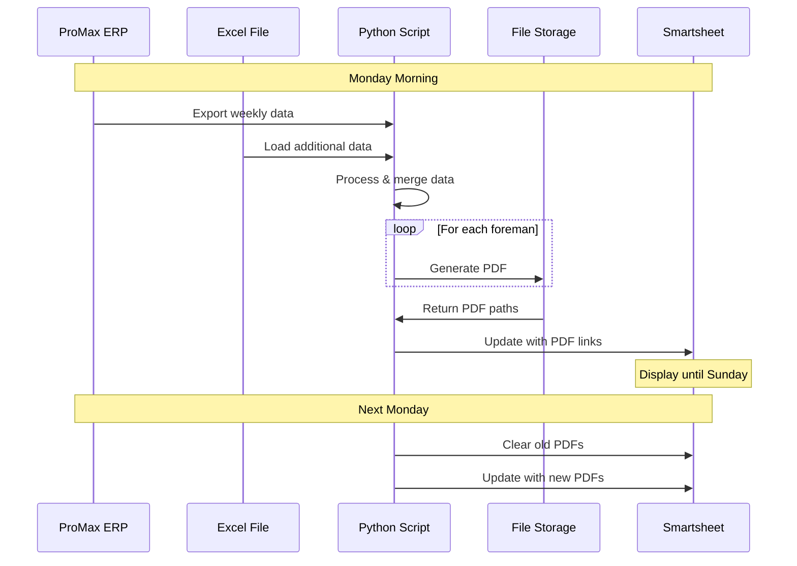

# Generate Weekly PDFs DSR Resiliency

<div class="repo-header">
  <h1>Generate Weekly PDFs DSR Resiliency</h1>
  <p>Python application that generates weekly PDF reports for each foreman from ProMax data, integrating Excel sheets and updating Smartsheet with PDF links.</p>
  <div class="badges">
    <span class="language-badge language-python">Python 98.9%</span>
    <span class="status-badge status-active">Active</span>
  </div>
</div>

## Overview

Generates weekly PDF reports for each foreman by combining data from ProMax ERP and Excel files. PDFs are displayed in Smartsheet until the corresponding Sunday, enabling billers to access weekly information efficiently.

**GitHub Repository**: [JFlo21/Generate-Weekly-PDFs-DSR-Resiliency](https://github.com/JFlo21/Generate-Weekly-PDFs-DSR-Resiliency)

**Description**: *Generates PDFs for the current Promax for each foreman for the week and displays it till the matching Sunday is reached which will allow the Billers to Grab that information from the smartsheet row.*

## Key Features

<div class="feature-list">

- **Weekly PDF Generation**: Creates foreman-specific reports
- **ProMax Integration**: Pulls data from ProMax ERP exports
- **Excel Data Merging**: Combines Excel worksheet data
- **Automated Distribution**: Updates Smartsheet with PDF links
- **Time-Based Display**: Shows PDFs until Sunday
- **Multi-Foreman Support**: Generates separate PDFs per foreman
- **Error Handling**: Robust error recovery
- **Scheduled Execution**: Runs weekly via cron

</div>

## Use Cases

- Weekly foreman performance reports
- DSR (Daily Service Report) compilation
- Resiliency tracking and reporting
- Weekly billing preparation
- Automated report distribution

## Architecture



## File Structure

```
Generate-Weekly-PDFs-DSR-Resiliency/
├── generate_weekly_pdfs.py   # Main generation script
├── pdf_generator.py           # PDF creation logic
├── data_processor.py          # Data processing
├── smartsheet_updater.py      # Smartsheet operations
├── config.py                  # Configuration
├── requirements.txt           # Python dependencies
├── templates/
│   └── foreman_report.html    # PDF template
├── .env.example               # Environment template
└── README.md                  # Documentation
```

## Environment Variables

| Variable | Required | Description | Example |
|----------|----------|-------------|---------|
| `SMARTSHEET_ACCESS_TOKEN` | Yes | API token | `ll...` |
| `SHEET_ID` | Yes | Target sheet ID | `1234567890123456` |
| `PROMAX_DATA_PATH` | Yes | ProMax export directory | `/data/promax` |
| `EXCEL_FILE_PATH` | Yes | Excel data file | `/data/weekly.xlsx` |
| `OUTPUT_PDF_DIR` | Yes | PDF output directory | `/var/pdfs` |
| `COLUMN_ID_PDF_URL` | Yes | PDF link column | `1111111111111111` |
| `COLUMN_ID_FOREMAN` | Yes | Foreman name column | `2222222222222222` |
| `COLUMN_ID_WEEK_START` | Yes | Week start column | `3333333333333333` |

## Setup Instructions

### 1. Clone Repository

```bash
git clone https://github.com/JFlo21/Generate-Weekly-PDFs-DSR-Resiliency.git
cd Generate-Weekly-PDFs-DSR-Resiliency
```

### 2. Install Dependencies

```bash
python -m venv venv
source venv/bin/activate
pip install -r requirements.txt
```

### 3. Configure Environment

```env
SMARTSHEET_ACCESS_TOKEN=your_token
SHEET_ID=1234567890123456
PROMAX_DATA_PATH=/path/to/promax/exports
EXCEL_FILE_PATH=/path/to/weekly_data.xlsx
OUTPUT_PDF_DIR=/var/pdfs/weekly
COLUMN_ID_PDF_URL=1111111111111111
COLUMN_ID_FOREMAN=2222222222222222
COLUMN_ID_WEEK_START=3333333333333333
COLUMN_ID_WEEK_END=4444444444444444
```

### 4. Setup File Storage

```bash
# Create output directory
mkdir -p /var/pdfs/weekly
chmod 755 /var/pdfs/weekly

# Optionally, serve PDFs via web server
# nginx config example:
# location /pdfs/ {
#     alias /var/pdfs/weekly/;
#     autoindex off;
# }
```

## Usage Examples

### Generate Weekly PDFs

```bash
python generate_weekly_pdfs.py
```

Output:
```
Loading ProMax data from /data/promax...
Loading Excel data from /data/weekly.xlsx...
Processing data for week of 2025-01-13...
Generating PDF for foreman: John Smith
Generating PDF for foreman: Jane Doe
Generating PDF for foreman: Bob Johnson
Generated 3 PDFs
Uploading PDFs...
Updating Smartsheet...
Updated 3 rows with PDF links
Done!
```

### Specific Week

```bash
python generate_weekly_pdfs.py --week 2025-01-13
```

### Specific Foreman

```bash
python generate_weekly_pdfs.py --foreman "John Smith"
```

### Test Mode

```bash
python generate_weekly_pdfs.py --dry-run
```

## Configuration

### ProMax Data Format

Expected ProMax CSV format:
```csv
Date,Foreman,Job,Hours,Material_Cost,Labor_Cost
2025-01-13,John Smith,JOB-1001,8.5,1200.00,680.00
2025-01-14,John Smith,JOB-1002,7.0,850.00,560.00
```

### Excel Data Format

Expected Excel structure:
```
Sheet1:
| Foreman      | Total_Jobs | Efficiency |
|--------------|------------|------------|
| John Smith   | 12         | 94%        |
| Jane Doe     | 15         | 97%        |
```

### PDF Template Customization

Edit `templates/foreman_report.html`:

```html
<!DOCTYPE html>
<html>
<head>
    <style>
        /* Custom styling */
    </style>
</head>
<body>
    <h1>Weekly Report - {{ foreman_name }}</h1>
    <p>Week of {{ week_start }} to {{ week_end }}</p>
    
    <table>
        <tr>
            <th>Job</th>
            <th>Hours</th>
            <th>Cost</th>
        </tr>
        
        <tr>
            <td>{{ job.name }}</td>
            <td>{{ job.hours }}</td>
            <td>${{ job.cost }}</td>
        </tr>
        
    </table>
</body>
</html>
```

## Dependencies

```txt
smartsheet-python-sdk>=3.0.0
pandas>=2.0.0
openpyxl>=3.1.0
reportlab>=4.0.0
weasyprint>=60.0
jinja2>=3.1.0
python-dotenv>=0.19.0
```

## Scheduling

### Cron Job (Weekly on Monday)

```bash
# Run every Monday at 6 AM
0 6 * * 1 cd /path/to/repo && /path/to/venv/bin/python generate_weekly_pdfs.py >> /var/log/weekly_pdfs.log 2>&1
```

### Systemd Timer

Create `/etc/systemd/system/weekly-pdfs.service`:
```ini
[Unit]
Description=Generate Weekly PDFs

[Service]
Type=oneshot
User=pdfuser
WorkingDirectory=/path/to/repo
Environment="PATH=/path/to/venv/bin"
ExecStart=/path/to/venv/bin/python generate_weekly_pdfs.py
```

Create `/etc/systemd/system/weekly-pdfs.timer`:
```ini
[Unit]
Description=Weekly PDF Generation Timer

[Timer]
OnCalendar=Mon *-*-* 06:00:00
Persistent=true

[Install]
WantedBy=timers.target
```

Enable:
```bash
sudo systemctl daemon-reload
sudo systemctl enable weekly-pdfs.timer
sudo systemctl start weekly-pdfs.timer
```

## PDF Management

### Auto-Cleanup

Remove old PDFs:
```python
def cleanup_old_pdfs(output_dir, days=30):
    cutoff = datetime.now() - timedelta(days=days)
    for file in os.listdir(output_dir):
        filepath = os.path.join(output_dir, file)
        if os.path.getmtime(filepath) < cutoff.timestamp():
            os.remove(filepath)
            print(f"Removed old PDF: {file}")
```

### Sunday Logic

```python
def should_display_pdf(week_start):
    """Check if PDF should still be displayed"""
    week_start_date = datetime.strptime(week_start, '%Y-%m-%d')
    sunday = week_start_date + timedelta(days=(6 - week_start_date.weekday()))
    return datetime.now() <= sunday
```

## Monitoring

### Check Generation Status

```bash
# View recent runs
tail -f /var/log/weekly_pdfs.log

# Count generated PDFs
ls -l /var/pdfs/weekly/*.pdf | wc -l

# Check PDF sizes
du -sh /var/pdfs/weekly/*.pdf
```

### Email Notifications

```python
def send_completion_email(foreman_count, pdf_count):
    import smtplib
    from email.mime.text import MIMEText
    
    msg = MIMEText(f"Generated {pdf_count} PDFs for {foreman_count} foremen")
    msg['Subject'] = 'Weekly PDF Generation Complete'
    msg['From'] = 'reports@company.com'
    msg['To'] = 'admin@company.com'
    
    with smtplib.SMTP('localhost') as s:
        s.send_message(msg)
```

## Troubleshooting

### ProMax Data Not Found

Check ProMax export path and permissions:
```bash
ls -la /path/to/promax/exports
```

### Excel File Errors

Verify Excel file format:
```python
python -c "import pandas as pd; print(pd.read_excel('file.xlsx').head())"
```

### PDF Generation Failures

Check dependencies:
```bash
# WeasyPrint may need system libraries
sudo apt-get install libpango-1.0-0 libpangoft2-1.0-0
```

### Smartsheet Update Failures

Verify column IDs and sheet access.

## Related Repositories

- **[Resiliency PDF Restructure](resiliency-pdf-restructure-ug-work.md)** - PDF validation
- **[Supabase Smartsheet Promax Offload](supabase-smartsheet-promax-offload.md)** - Database sync

## Additional Resources

- [Repository on GitHub](https://github.com/JFlo21/Generate-Weekly-PDFs-DSR-Resiliency)
- [ReportLab Documentation](https://www.reportlab.com/docs/)
- [Usage Guide](../usage-guide.md)
- [Troubleshooting](../troubleshooting.md)
