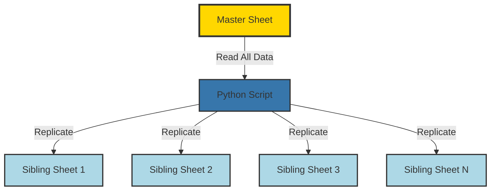

# Master to Sibling Smartsheet Function

<div class="repo-header">
  <h1>Master to Sibling Smartsheet Function</h1>
  <p>Python script that replicates data from a master Smartsheet to multiple sibling sheets, maintaining data consistency across related sheets.</p>
  <div class="badges">
    <span class="language-badge language-python">Python 100%</span>
    <span class="status-badge status-active">Active</span>
  </div>
</div>

## Overview

This repository provides a Python-based solution for the master-sibling sheet pattern, where data from one authoritative "master" sheet needs to be replicated to multiple "sibling" sheets. Perfect for scenarios where multiple teams need read-only copies of centralized data.

**GitHub Repository**: [JFlo21/master-to-sibling-smartsheet-function](https://github.com/JFlo21/master-to-sibling-smartsheet-function)

## Key Features

<div class="feature-list">

- **One-to-Many Replication**: Copy from one master to N siblings
- **Selective Column Sync**: Choose which columns to replicate
- **Efficient Updates**: Only updates changed data
- **Batch Processing**: Handles large datasets
- **Error Recovery**: Continues on partial failures
- **Dry-Run Mode**: Test without making changes
- **Detailed Logging**: Track all replication operations

</div>

## Use Cases

- Distributing centralized reference data to teams
- Creating department-specific views of master data
- Maintaining synchronized project information across teams
- Replicating approved data to execution sheets

## Architecture



## File Structure

```
master-to-sibling-smartsheet-function/
├── master_to_sibling.py    # Main replication script
├── config.py                # Configuration management
├── requirements.txt         # Python dependencies
├── .env.example             # Environment template
└── README.md                # Documentation
```

## Environment Variables

| Variable | Required | Description | Example |
|----------|----------|-------------|---------|
| `SMARTSHEET_ACCESS_TOKEN` | Yes | Smartsheet API token | `ll...` |
| `MASTER_SHEET_ID` | Yes | Master sheet ID | `1234567890123456` |
| `SIBLING_SHEET_IDS` | Yes | Comma-separated sibling IDs | `111,222,333` |
| `REPLICATED_COLUMN_IDS` | No | Specific columns to copy | `1111,2222,3333` |
| `DRY_RUN` | No | Test mode | `false` |

## Setup Instructions

### 1. Clone Repository

```bash
git clone https://github.com/JFlo21/master-to-sibling-smartsheet-function.git
cd master-to-sibling-smartsheet-function
```

### 2. Install Dependencies

```bash
python -m venv venv
source venv/bin/activate  # Windows: venv\Scripts\activate
pip install -r requirements.txt
```

### 3. Configure Environment

```bash
cp .env.example .env
nano .env
```

Example `.env`:
```env
SMARTSHEET_ACCESS_TOKEN=your_smartsheet_token
MASTER_SHEET_ID=1234567890123456
SIBLING_SHEET_IDS=2345678901234567,3456789012345678,4567890123456789
# Optional: Specify columns (leave empty for all)
REPLICATED_COLUMN_IDS=
DRY_RUN=false
```

## Usage Examples

### Basic Replication

```bash
python master_to_sibling.py
```

### Dry-Run Mode

```bash
python master_to_sibling.py --dry-run
```

### Specific Sibling Only

```bash
python master_to_sibling.py --sibling 2345678901234567
```

### Verbose Logging

```bash
python master_to_sibling.py --verbose
```

## Configuration

### Column Selection

Replicate all columns:
```env
REPLICATED_COLUMN_IDS=
```

Replicate specific columns only:
```env
REPLICATED_COLUMN_IDS=1234567890123456,2345678901234567
```

### Match Strategies

**By Row ID** (default):
```python
# Matches rows by their Smartsheet row ID
# Good for initial copy, not for ongoing sync
```

**By Unique Key**:
```python
# Match by a unique identifier column
MATCH_COLUMN_ID=1234567890123456  # e.g., Job Number
```

## Dependencies

```txt
smartsheet-python-sdk>=3.0.0
python-dotenv>=0.19.0
```

## Scheduling

### Cron Job

```bash
# Run every 4 hours
0 */4 * * * cd /path/to/repo && /path/to/venv/bin/python master_to_sibling.py
```

### Triggered by Webhook

Use Smartsheet webhooks to trigger on changes:

```python
from flask import Flask, request

app = Flask(__name__)

@app.route('/webhook', methods=['POST'])
def webhook_handler():
    data = request.json
    if data.get('events'):
        # Master sheet changed, trigger sync
        os.system('python master_to_sibling.py')
    return '', 200
```

## Best Practices

!!! tip "Replication Tips"
    - Set sibling sheets to read-only for users
    - Run replication during off-peak hours
    - Test with dry-run before production
    - Monitor for replication lag

## Troubleshooting

### Data Not Replicating

Check master sheet has data:
```python
python -c "from smartsheet_client import get_sheet; print(get_sheet('MASTER_ID').total_row_count)"
```

### Permission Errors

Ensure API token has Editor access to all sheets (master + siblings).

### Partial Failures

Script continues on per-sheet failures. Check logs for details.

## Related Repositories

- **[Smartsheet Supabase Sync](smartsheet-supabase-sync.md)** - Sheet to database
- **[Generate Job Numbers](generate-job-numbers.md)** - Auto-numbering

## Additional Resources

- [Repository on GitHub](https://github.com/JFlo21/master-to-sibling-smartsheet-function)
- [Usage Guide](../usage-guide.md)
- [Troubleshooting](../troubleshooting.md)
