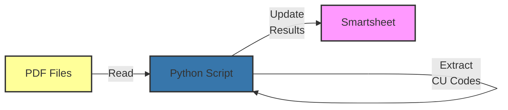

# Resiliency PDF Restructure UG Work

<div class="repo-header">
  <h1>Resiliency PDF Restructure UG Work</h1>
  <p>Python application that validates PDF structure, extracts CU codes, and updates Smartsheet with validation results.</p>
  <div class="badges">
    <span class="language-badge language-python">Python 66%</span>
    <span class="status-badge status-active">Active</span>
  </div>
</div>

## Overview

Validates the structure of generated PDFs, extracts Construction Unit (CU) codes, verifies formatting compliance, and updates Smartsheet with validation status and extracted data.

**GitHub Repository**: Repository may be private or not yet public

## Key Features

<div class="feature-list">

- **PDF Structure Validation**: Checks PDF format and structure
- **CU Code Extraction**: Extracts Construction Unit codes from PDFs
- **Format Verification**: Ensures PDFs meet specifications
- **Smartsheet Integration**: Updates validation results
- **Batch Processing**: Validates multiple PDFs efficiently
- **Error Reporting**: Detailed validation failure messages
- **Automated Execution**: Runs after PDF generation

</div>

## Use Cases

- Validating generated foreman reports
- Extracting CU codes for billing
- Quality assurance for automated reports
- Ensuring PDF compliance with requirements
- Audit trail for generated documents

## Architecture



## File Structure

```
Resiliency-pdf-restructure-ug-work/
├── pdf_restructure.py         # Main validation script
├── pdf_validator.py           # PDF validation logic
├── cu_code_extractor.py       # CU code extraction
├── smartsheet_updater.py      # Smartsheet operations
├── config.py                  # Configuration
├── requirements.txt           # Dependencies
├── .env.example               # Environment template
└── README.md                  # Documentation
```

## Environment Variables

| Variable | Required | Description | Example |
|----------|----------|-------------|---------|
| `SMARTSHEET_ACCESS_TOKEN` | Yes | API token | `ll...` |
| `SHEET_ID` | Yes | Target sheet ID | `1234567890123456` |
| `PDF_DIRECTORY` | Yes | Directory with PDFs | `/var/pdfs/weekly` |
| `COLUMN_ID_CU_CODE` | Yes | CU code column | `1111111111111111` |
| `COLUMN_ID_VALIDATION` | Yes | Validation status column | `2222222222222222` |
| `COLUMN_ID_VALIDATION_DATE` | Yes | Validation date column | `3333333333333333` |
| `COLUMN_ID_PDF_PATH` | No | PDF file path column | `4444444444444444` |

## Setup Instructions

### 1. Clone Repository

```bash
git clone https://github.com/JFlo21/Resiliency-pdf-restructure-ug-work.git
cd Resiliency-pdf-restructure-ug-work
```

### 2. Install Dependencies

```bash
python -m venv venv
source venv/bin/activate
pip install -r requirements.txt
```

### 3. Configure Environment

```env
SMARTSHEET_ACCESS_TOKEN=your_token
SHEET_ID=1234567890123456
PDF_DIRECTORY=/var/pdfs/weekly
COLUMN_ID_CU_CODE=1111111111111111
COLUMN_ID_VALIDATION=2222222222222222
COLUMN_ID_VALIDATION_DATE=3333333333333333
COLUMN_ID_ERROR_MESSAGE=4444444444444444
```

## Usage Examples

### Validate All PDFs

```bash
python pdf_restructure.py
```

Output:
```
Validating PDFs in /var/pdfs/weekly...
Validating foreman_john_smith_2025-01-13.pdf... PASS
  Extracted CU code: CU-12345
Validating foreman_jane_doe_2025-01-13.pdf... PASS
  Extracted CU code: CU-12346
Validating foreman_bob_johnson_2025-01-13.pdf... FAIL
  Error: Missing CU code section
Updated Smartsheet with 3 validation results
```

### Validate Specific PDF

```bash
python pdf_restructure.py --pdf /var/pdfs/weekly/foreman_john.pdf
```

### Dry-Run Mode

```bash
python pdf_restructure.py --dry-run
```

### Verbose Output

```bash
python pdf_restructure.py --verbose
```

## Validation Rules

### Structure Checks

1. **PDF Format**: Valid PDF structure
2. **Page Count**: Expected number of pages
3. **Text Extraction**: Text is extractable
4. **Font Compliance**: Uses approved fonts
5. **Image Quality**: Images meet resolution requirements

### CU Code Validation

```python
import re

def validate_cu_code(text):
    """
    CU code format: CU-##### where # is digit
    """
    pattern = r'CU-\d{5}'
    match = re.search(pattern, text)
    
    if not match:
        return None, "CU code not found"
    
    cu_code = match.group(0)
    
    # Additional validation
    if not is_valid_cu_code(cu_code):
        return None, f"Invalid CU code: {cu_code}"
    
    return cu_code, None
```

### Format Requirements

```python
def validate_pdf_structure(pdf_path):
    errors = []
    
    # Check page count
    if page_count != 1:
        errors.append(f"Expected 1 page, found {page_count}")
    
    # Check for required sections
    required_sections = ['Header', 'Summary', 'Details', 'CU Code']
    for section in required_sections:
        if section not in text:
            errors.append(f"Missing section: {section}")
    
    # Check date format
    if not re.search(r'\d{4}-\d{2}-\d{2}', text):
        errors.append("Date not found in expected format")
    
    return errors
```

## Dependencies

```txt
smartsheet-python-sdk>=3.0.0
PyPDF2>=3.0.0
pdfplumber>=0.10.0
python-dotenv>=0.19.0
pillow>=10.0.0
```

## PDF Extraction

### Extract Text

```python
import pdfplumber

def extract_pdf_text(pdf_path):
    with pdfplumber.open(pdf_path) as pdf:
        text = ''
        for page in pdf.pages:
            text += page.extract_text()
        return text
```

### Extract Tables

```python
def extract_tables(pdf_path):
    with pdfplumber.open(pdf_path) as pdf:
        tables = []
        for page in pdf.pages:
            tables.extend(page.extract_tables())
        return tables
```

### Extract Metadata

```python
from PyPDF2 import PdfReader

def extract_metadata(pdf_path):
    reader = PdfReader(pdf_path)
    return {
        'page_count': len(reader.pages),
        'author': reader.metadata.get('/Author'),
        'title': reader.metadata.get('/Title'),
        'created': reader.metadata.get('/CreationDate'),
    }
```

## Smartsheet Updates

### Update Validation Results

```python
def update_validation_results(sheet_id, pdf_name, cu_code, status, errors):
    # Find row by PDF name
    row = find_row_by_pdf_name(sheet_id, pdf_name)
    
    if not row:
        logger.warning(f"No row found for PDF: {pdf_name}")
        return
    
    # Update cells
    cells = [
        {
            'column_id': COLUMN_ID_CU_CODE,
            'value': cu_code or ''
        },
        {
            'column_id': COLUMN_ID_VALIDATION,
            'value': status  # 'Pass' or 'Fail'
        },
        {
            'column_id': COLUMN_ID_VALIDATION_DATE,
            'value': datetime.now().strftime('%Y-%m-%d')
        }
    ]
    
    if errors:
        cells.append({
            'column_id': COLUMN_ID_ERROR_MESSAGE,
            'value': '; '.join(errors)
        })
    
    update_row(sheet_id, row.id, cells)
```

## Scheduling

### Run After PDF Generation

```bash
# Combined script
#!/bin/bash

# Generate PDFs
python /path/to/generate_weekly_pdfs.py

# Validate PDFs
python /path/to/pdf_restructure.py

# Send notification
mail -s "Weekly PDFs Generated and Validated" admin@company.com < /var/log/pdfs.log
```

### Cron Job

```bash
# Run every Monday at 7 AM (1 hour after PDF generation)
0 7 * * 1 cd /path/to/repo && /path/to/venv/bin/python pdf_restructure.py
```

## Error Handling

### Validation Failures

```python
class ValidationError(Exception):
    pass

try:
    validate_pdf(pdf_path)
except ValidationError as e:
    logger.error(f"Validation failed for {pdf_path}: {e}")
    update_smartsheet_with_error(pdf_name, str(e))
```

### Missing PDFs

```python
def validate_all_pdfs(pdf_dir):
    pdf_files = glob.glob(os.path.join(pdf_dir, '*.pdf'))
    
    if not pdf_files:
        logger.warning(f"No PDF files found in {pdf_dir}")
        return
    
    for pdf_file in pdf_files:
        try:
            validate_pdf(pdf_file)
        except Exception as e:
            logger.error(f"Error validating {pdf_file}: {e}")
            continue
```

## Monitoring

### Validation Metrics

```python
metrics = {
    'total_pdfs': 0,
    'passed': 0,
    'failed': 0,
    'cu_codes_extracted': 0,
    'errors': []
}

# Track metrics during validation
# Log to file or database
```

### Alerts

```python
def send_alert_if_failures(metrics):
    if metrics['failed'] > 0:
        message = f"PDF validation failures: {metrics['failed']}/{metrics['total_pdfs']}"
        send_email_alert(message)
```

## Troubleshooting

### Cannot Extract Text

```bash
# Check PDF is not scanned/image-based
pdftotext file.pdf -
```

If text extraction fails, PDF may need OCR:
```bash
# Install Tesseract OCR
sudo apt-get install tesseract-ocr
pip install pytesseract
```

### CU Code Not Found

Check PDF content manually:
```bash
pdftotext foreman_report.pdf - | grep -i "CU-"
```

### Permission Errors

Ensure script has read access to PDF directory:
```bash
ls -la /var/pdfs/weekly
chmod 755 /var/pdfs/weekly
```

## Related Repositories

- **[Generate Weekly PDFs](generate-weekly-pdfs-dsr-resiliency.md)** - PDF generation
- **[Supabase Smartsheet Promax Offload](supabase-smartsheet-promax-offload.md)** - Database sync

## Additional Resources

- [PyPDF2 Documentation](https://pypdf2.readthedocs.io/)
- [pdfplumber Documentation](https://github.com/jsvine/pdfplumber)
- [Usage Guide](../usage-guide.md)
- [Troubleshooting](../troubleshooting.md)
