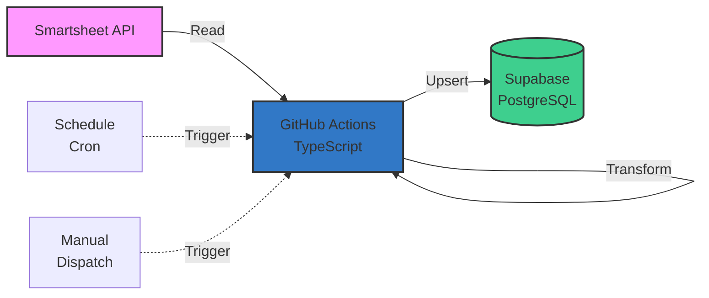

# Smartsheet Supabase Sync

<div class="repo-header">
  <h1>Smartsheet Supabase Sync</h1>
  <p>TypeScript GitHub Actions workflow that syncs data from Smartsheet to Supabase PostgreSQL database on a scheduled basis.</p>
  <div class="badges">
    <span class="language-badge language-typescript">TypeScript 40.5%</span>
    <span class="status-badge status-active">Active</span>
  </div>
</div>

## Overview

A serverless GitHub Actions workflow written in TypeScript that automatically syncs Smartsheet data to a Supabase database. Perfect for maintaining a queryable database copy of your Smartsheet data for analytics, reporting, or integration with other systems.

**GitHub Repository**: Repository may be private or not yet public

## Key Features

<div class="feature-list">

- **Serverless Execution**: Runs in GitHub Actions, no infrastructure needed
- **Scheduled Syncs**: Automatic execution on defined schedule
- **TypeScript**: Type-safe code with modern JavaScript features
- **Incremental Sync**: Only syncs changed data (optional)
- **Upsert Logic**: Intelligently adds or updates records
- **GitHub Secrets**: Secure credential management
- **Action Logs**: Full visibility into sync operations
- **Manual Trigger**: Can be triggered manually via workflow_dispatch

</div>

## Use Cases

- Maintaining a database replica of Smartsheet data
- Enabling SQL queries on Smartsheet data
- Creating analytics dashboards from Smartsheet
- Integrating Smartsheet with other applications via database
- Archiving Smartsheet data

## Architecture



## File Structure

```
Smartsheet-supabase-sync/
├── .github/
│   └── workflows/
│       └── sync.yml          # GitHub Actions workflow
├── src/
│   ├── index.ts              # Main entry point
│   ├── smartsheet.ts         # Smartsheet API client
│   ├── supabase.ts           # Supabase client
│   ├── config.ts             # Configuration
│   ├── mappings.ts           # Column mappings
│   └── types.ts              # TypeScript types
├── package.json              # Node dependencies
├── tsconfig.json             # TypeScript configuration
├── .env.example              # Environment template
└── README.md                 # Documentation
```

## Environment Variables

| Variable | Required | Description | Where to Set |
|----------|----------|-------------|--------------|
| `SMARTSHEET_ACCESS_TOKEN` | Yes | Smartsheet API token | GitHub Secrets |
| `SUPABASE_URL` | Yes | Supabase project URL | GitHub Secrets |
| `SUPABASE_KEY` | Yes | Supabase service key | GitHub Secrets |
| `SHEET_ID` | Yes | Source Smartsheet ID | GitHub Secrets |
| `TABLE_NAME` | Yes | Target Supabase table | GitHub Secrets |

## Setup Instructions

### 1. Fork Repository

```bash
# Fork the repository to your GitHub account
# Then clone your fork
git clone https://github.com/YOUR_USERNAME/Smartsheet-supabase-sync.git
cd Smartsheet-supabase-sync
```

### 2. Install Dependencies

```bash
npm install
```

### 3. Configure GitHub Secrets

Go to your repository on GitHub:
1. Click **Settings** → **Secrets and variables** → **Actions**
2. Click **New repository secret**
3. Add each secret:

| Secret Name | Value |
|-------------|-------|
| `SMARTSHEET_ACCESS_TOKEN` | Your Smartsheet API token |
| `SUPABASE_URL` | https://your-project.supabase.co |
| `SUPABASE_KEY` | Your Supabase service role key |
| `SHEET_ID` | Your Smartsheet sheet ID |
| `TABLE_NAME` | Your Supabase table name |

### 4. Create Supabase Table

```sql
CREATE TABLE smartsheet_data (
  id BIGSERIAL PRIMARY KEY,
  smartsheet_row_id BIGINT UNIQUE NOT NULL,
  job_name TEXT,
  status TEXT,
  assigned_to TEXT,
  created_at TIMESTAMP DEFAULT NOW(),
  updated_at TIMESTAMP DEFAULT NOW()
);

-- Index for faster lookups
CREATE INDEX idx_smartsheet_row_id ON smartsheet_data(smartsheet_row_id);

-- Trigger to update updated_at
CREATE OR REPLACE FUNCTION update_updated_at_column()
RETURNS TRIGGER AS $$
BEGIN
    NEW.updated_at = NOW();
    RETURN NEW;
END;
$$ language 'plpgsql';

CREATE TRIGGER update_smartsheet_data_updated_at 
BEFORE UPDATE ON smartsheet_data 
FOR EACH ROW EXECUTE FUNCTION update_updated_at_column();
```

### 5. Configure Workflow Schedule

Edit `.github/workflows/sync.yml`:

```yaml
on:
  schedule:
    # Run every hour at minute 0
    - cron: '0 * * * *'
    # Or daily at 6 AM UTC
    # - cron: '0 6 * * *'
  workflow_dispatch:  # Allow manual trigger
```

## Usage Examples

### Manual Trigger

1. Go to **Actions** tab in GitHub
2. Select **Smartsheet Supabase Sync** workflow
3. Click **Run workflow**
4. Select branch and click **Run workflow**

### Local Development

```bash
# Install dependencies
npm install

# Create .env file
cp .env.example .env
# Edit .env with your credentials

# Run locally
npm run start

# Or with TypeScript watch mode
npm run dev
```

Example `.env` for local development:
```env
SMARTSHEET_ACCESS_TOKEN=your_token
SUPABASE_URL=https://your-project.supabase.co
SUPABASE_KEY=your_key
SHEET_ID=1234567890123456
TABLE_NAME=smartsheet_data
```

### Test Mode

```bash
# Dry run without database writes
npm run test
```

## Configuration Options

### Column Mapping

Edit `src/mappings.ts`:

```typescript
export const columnMappings = {
  'Job Name': 'job_name',
  'Status': 'status',
  'Assigned To': 'assigned_to',
  'Created Date': 'created_at',
};

export function mapSmartsheetRow(row: any): any {
  const mapped: any = {
    smartsheet_row_id: row.id,
  };
  
  for (const cell of row.cells) {
    const columnName = getColumnName(cell.columnId);
    const dbColumn = columnMappings[columnName];
    
    if (dbColumn) {
      mapped[dbColumn] = cell.value;
    }
  }
  
  return mapped;
}
```

### Incremental Sync

Enable incremental sync to only process changed rows:

```typescript
// src/smartsheet.ts
export async function fetchChangedRows(
  sheetId: string,
  since: Date
): Promise<any[]> {
  const isoDate = since.toISOString();
  
  const response = await smartsheet.sheets.getSheet({
    id: sheetId,
    rowsModifiedSince: isoDate,
  });
  
  return response.rows;
}
```

Store last sync time:

```typescript
// Store in Supabase
CREATE TABLE sync_metadata (
  id SERIAL PRIMARY KEY,
  sheet_id TEXT UNIQUE,
  last_sync TIMESTAMP,
  status TEXT
);
```

## Dependencies

### Node.js Packages

```json
{
  "dependencies": {
    "@supabase/supabase-js": "^2.38.0",
    "dotenv": "^16.0.0",
    "axios": "^1.6.0"
  },
  "devDependencies": {
    "@types/node": "^20.0.0",
    "typescript": "^5.0.0",
    "ts-node": "^10.9.0"
  }
}
```

Install:
```bash
npm install
```

## Error Handling

### Retry Logic

```typescript
async function upsertWithRetry(
  table: string,
  data: any,
  maxRetries = 3
): Promise<void> {
  for (let attempt = 0; attempt < maxRetries; attempt++) {
    try {
      await supabase.from(table).upsert(data, {
        onConflict: 'smartsheet_row_id',
      });
      return;
    } catch (error) {
      console.error(`Attempt ${attempt + 1} failed:`, error);
      if (attempt < maxRetries - 1) {
        await sleep(2 ** attempt * 1000);  // Exponential backoff
      } else {
        throw error;
      }
    }
  }
}
```

### Error Notifications

Add Slack or email notifications on failure:

```yaml
# .github/workflows/sync.yml
jobs:
  sync:
    runs-on: ubuntu-latest
    steps:
      # ... sync steps ...
      
      - name: Notify on failure
        if: failure()
        uses: 8398a7/action-slack@v3
        with:
          status: ${{ job.status }}
          text: 'Smartsheet sync failed!'
          webhook_url: ${{ secrets.SLACK_WEBHOOK }}
```

## Monitoring

### View Workflow Runs

1. Go to **Actions** tab
2. Select workflow
3. View run history and logs

### Check Logs

```typescript
// Enhanced logging in src/index.ts
console.log('=== Smartsheet Supabase Sync Started ===');
console.log(`Syncing sheet: ${SHEET_ID}`);
console.log(`Target table: ${TABLE_NAME}`);

const rows = await fetchSmartsheetRows(SHEET_ID);
console.log(`Fetched ${rows.length} rows from Smartsheet`);

const mapped = rows.map(mapSmartsheetRow);
await upsertToSupabase(TABLE_NAME, mapped);
console.log(`Upserted ${mapped.length} rows to Supabase`);

console.log('=== Sync Completed Successfully ===');
```

### Metrics

Track sync metrics:

```typescript
interface SyncMetrics {
  startTime: Date;
  endTime: Date;
  rowsFetched: number;
  rowsUpserted: number;
  errors: number;
  duration: number;
}

async function logMetrics(metrics: SyncMetrics) {
  await supabase.from('sync_logs').insert({
    sheet_id: SHEET_ID,
    ...metrics,
  });
}
```

## Workflow Configuration

### Schedule Options

```yaml
on:
  schedule:
    # Every hour
    - cron: '0 * * * *'
    
    # Every 6 hours
    - cron: '0 */6 * * *'
    
    # Daily at 6 AM UTC
    - cron: '0 6 * * *'
    
    # Weekdays at 8 AM UTC
    - cron: '0 8 * * 1-5'
```

### Timeout and Concurrency

```yaml
jobs:
  sync:
    runs-on: ubuntu-latest
    timeout-minutes: 30
    concurrency:
      group: smartsheet-sync
      cancel-in-progress: false  # Don't cancel running sync
```

## Troubleshooting

### Workflow Not Running

1. Check workflow file syntax
2. Verify cron expression is valid
3. Ensure Actions are enabled in repo settings

### Authentication Errors

```bash
# Test Smartsheet token
curl -H "Authorization: Bearer $SMARTSHEET_ACCESS_TOKEN" \
  https://api.smartsheet.com/2.0/users/me

# Test Supabase connection
curl "$SUPABASE_URL/rest/v1/table_name?limit=1" \
  -H "apikey: $SUPABASE_KEY"
```

### Data Not Syncing

1. Check GitHub Actions logs
2. Verify column mappings are correct
3. Ensure Supabase table exists
4. Check for unique constraint violations

## Related Repositories

- **[Supabase Smartsheet Promax Offload](supabase-smartsheet-promax-offload.md)** - Reverse sync (Supabase → Smartsheet)
- **[Master to Sibling](master-to-sibling-smartsheet-function.md)** - Sheet-to-sheet replication

## Additional Resources

- [GitHub Actions Documentation](https://docs.github.com/en/actions)
- [Supabase JavaScript Client](https://supabase.com/docs/reference/javascript/introduction)
- [TypeScript Documentation](https://www.typescriptlang.org/docs/)
- [Usage Guide](../usage-guide.md)
- [Troubleshooting](../troubleshooting.md)
