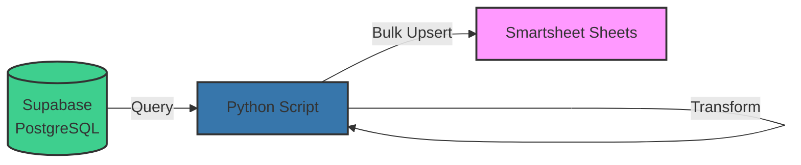

# Supabase Smartsheet Promax Offload

<div class="repo-header">
  <h1>Supabase Smartsheet Promax Offload</h1>
  <p>Python application that offloads data from Supabase PostgreSQL database to Smartsheet sheets using bulk upsert operations.</p>
  <div class="badges">
    <span class="language-badge language-python">Python 94.7%</span>
    <span class="status-badge status-active">Active</span>
  </div>
</div>

## Overview

This repository provides a robust Python-based solution for syncing data from a Supabase database to Smartsheet. It's designed to handle large datasets efficiently using bulk operations and includes comprehensive error handling and retry logic.

**GitHub Repository**: Repository may be private or not yet public

## Key Features

<div class="feature-list">

- **Bulk Upsert Operations**: Efficiently updates multiple rows in a single API call
- **Retry Logic**: Automatically retries failed operations with exponential backoff
- **Rate Limit Handling**: Respects Smartsheet API rate limits
- **Configurable Mappings**: Easy column mapping configuration
- **Error Handling**: Comprehensive error catching and logging
- **Dry-Run Mode**: Test without making actual changes
- **Progress Tracking**: Detailed logging of sync progress

</div>

## Use Cases

- Offloading Promax ERP data from Supabase to Smartsheet
- Syncing processed data back to business users
- Creating Smartsheet views of database records
- Maintaining audit trails in Smartsheet

## Architecture



## File Structure

```
supabase-smartsheet-promax-offload/
├── main.py                 # Main application entry point
├── config.py               # Configuration management
├── smartsheet_client.py    # Smartsheet API wrapper
├── supabase_client.py      # Supabase API wrapper
├── mappings.py             # Column mapping definitions
├── requirements.txt        # Python dependencies
├── .env.example            # Environment variable template
└── README.md               # Repository documentation
```

## Environment Variables

| Variable | Required | Description | Example |
|----------|----------|-------------|---------|
| `SMARTSHEET_ACCESS_TOKEN` | Yes | Smartsheet API access token | `ll...` |
| `SUPABASE_URL` | Yes | Supabase project URL | `https://xyz.supabase.co` |
| `SUPABASE_KEY` | Yes | Supabase service role key | `eyJ...` |
| `SHEET_ID` | Yes | Target Smartsheet sheet ID | `1234567890123456` |
| `TABLE_NAME` | Yes | Supabase table to query | `promax_data` |
| `BATCH_SIZE` | No | Rows per batch (default: 100) | `100` |
| `DRY_RUN` | No | Test mode without writes | `false` |

## Setup Instructions

### 1. Clone Repository

```bash
git clone https://github.com/JFlo21/supabase-smartsheet-promax-offload.git
cd supabase-smartsheet-promax-offload
```

### 2. Install Dependencies

```bash
# Create virtual environment
python -m venv venv
source venv/bin/activate  # On Windows: venv\Scripts\activate

# Install packages
pip install -r requirements.txt
```

### 3. Configure Environment

```bash
# Copy example env file
cp .env.example .env

# Edit .env with your credentials
nano .env
```

Example `.env`:
```env
SMARTSHEET_ACCESS_TOKEN=your_smartsheet_token
SUPABASE_URL=https://your-project.supabase.co
SUPABASE_KEY=your_supabase_service_key
SHEET_ID=1234567890123456
TABLE_NAME=promax_data
BATCH_SIZE=100
DRY_RUN=false
```

### 4. Configure Column Mappings

Edit `mappings.py` to define how Supabase columns map to Smartsheet columns:

```python
# mappings.py
COLUMN_MAPPINGS = {
    'id': 1234567890123456,          # Supabase 'id' → Smartsheet column ID
    'job_name': 2345678901234567,    # Supabase 'job_name' → Smartsheet column ID
    'status': 3456789012345678,      # Supabase 'status' → Smartsheet column ID
    'created_at': 4567890123456789,  # Supabase 'created_at' → Smartsheet column ID
}
```

## Usage Examples

### Basic Execution

```bash
# Run sync
python main.py
```

### Dry-Run Mode

```bash
# Test without making changes
python main.py --dry-run
```

### With Verbose Logging

```bash
# Enable debug output
python main.py --verbose
```

### Limit Rows

```bash
# Process only first 50 rows (for testing)
python main.py --limit 50
```

## Configuration Options

### Batch Size

Control how many rows are processed in each API call:

```python
# In config.py or .env
BATCH_SIZE = 100  # Process 100 rows at a time
```

### Query Filtering

Modify the Supabase query to filter data:

```python
# In supabase_client.py
def fetch_data(table_name, filters=None):
    query = supabase.table(table_name).select('*')
    
    # Add filters
    if filters:
        if 'status' in filters:
            query = query.eq('status', filters['status'])
        if 'date_from' in filters:
            query = query.gte('created_at', filters['date_from'])
    
    return query.execute()
```

### Upsert Strategy

Choose how to handle existing rows:

```python
# Option 1: Match by external ID
row.external_id = f"promax_{record['id']}"

# Option 2: Search and update
existing_row = find_row_by_value(sheet_id, column_id, value)
if existing_row:
    update_row(existing_row.id, new_data)
else:
    insert_row(new_data)
```

## Dependencies

### Python Packages

```txt
smartsheet-python-sdk>=3.0.0
supabase>=1.0.0
python-dotenv>=0.19.0
requests>=2.28.0
```

Install all:
```bash
pip install -r requirements.txt
```

## Error Handling

### Retry Logic

```python
def upsert_with_retry(sheet_id, rows, max_retries=3):
    for attempt in range(max_retries):
        try:
            return client.Sheets.update_rows(sheet_id, rows)
        except smartsheet.exceptions.ApiError as e:
            if e.error.result.status_code == 429:  # Rate limit
                time.sleep(60)
            elif attempt < max_retries - 1:
                time.sleep(2 ** attempt)  # Exponential backoff
            else:
                raise
```

### Error Logging

All errors are logged with context:

```
2025-01-15 10:30:45 - ERROR - Failed to update row 123: Invalid column ID
2025-01-15 10:30:45 - INFO - Retrying in 2 seconds...
2025-01-15 10:30:47 - INFO - Retry successful
```

## Scheduling

### Cron Job (Linux)

```bash
# Run every 6 hours
0 */6 * * * cd /path/to/repo && /path/to/venv/bin/python main.py >> /var/log/offload.log 2>&1
```

### Systemd Timer (Linux)

Create `/etc/systemd/system/smartsheet-offload.service`:
```ini
[Unit]
Description=Smartsheet Offload Service

[Service]
Type=oneshot
User=your_user
WorkingDirectory=/path/to/repo
Environment="PATH=/path/to/venv/bin"
ExecStart=/path/to/venv/bin/python main.py
```

Create `/etc/systemd/system/smartsheet-offload.timer`:
```ini
[Unit]
Description=Run Smartsheet Offload every 6 hours

[Timer]
OnCalendar=*-*-* 00/6:00:00
Persistent=true

[Install]
WantedBy=timers.target
```

Enable:
```bash
sudo systemctl daemon-reload
sudo systemctl enable smartsheet-offload.timer
sudo systemctl start smartsheet-offload.timer
```

## Monitoring

### Check Status

```bash
# View recent runs
tail -f /var/log/offload.log

# Check for errors
grep ERROR /var/log/offload.log

# Count successful syncs
grep "Sync completed successfully" /var/log/offload.log | wc -l
```

### Metrics to Track

- Sync duration
- Number of rows processed
- Error count
- API rate limit hits

## Troubleshooting

### No Data Syncing

1. Check Supabase connection:
```python
python -c "from supabase_client import test_connection; test_connection()"
```

2. Verify table name and query:
```python
python -c "from supabase_client import fetch_data; print(fetch_data('your_table'))"
```

3. Check column mappings match sheet structure

### Rate Limit Errors

- Increase batch processing delay
- Reduce batch size
- Check for other scripts using the same token

### Data Type Mismatches

Ensure proper type conversion:
```python
def convert_for_smartsheet(value, column_type):
    if column_type == 'DATE' and isinstance(value, datetime):
        return value.strftime('%Y-%m-%d')
    elif column_type == 'CHECKBOX':
        return bool(value)
    return value
```

## Related Repositories

- **[Smartsheet Supabase Sync](smartsheet-supabase-sync.md)** - Reverse sync (Smartsheet → Supabase)
- **[Master to Sibling](master-to-sibling-smartsheet-function.md)** - Sheet-to-sheet replication

## Additional Resources

- [Smartsheet API Documentation](https://smartsheet-platform.github.io/api-docs/)
- [Supabase Python Client](https://github.com/supabase-community/supabase-py)
- [Usage Guide](../usage-guide.md) - Setup instructions
- [Troubleshooting](../troubleshooting.md) - Common issues
