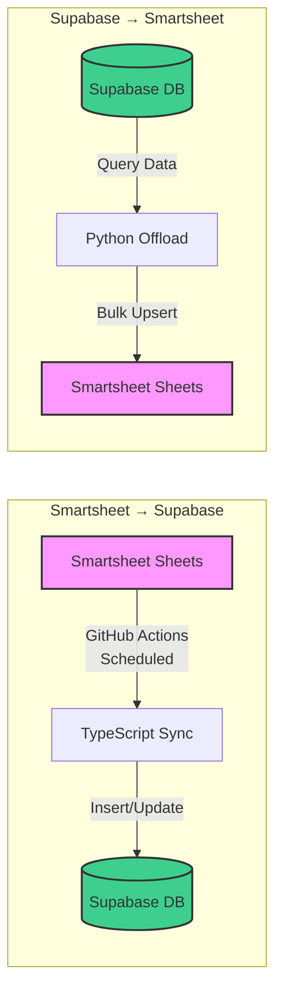
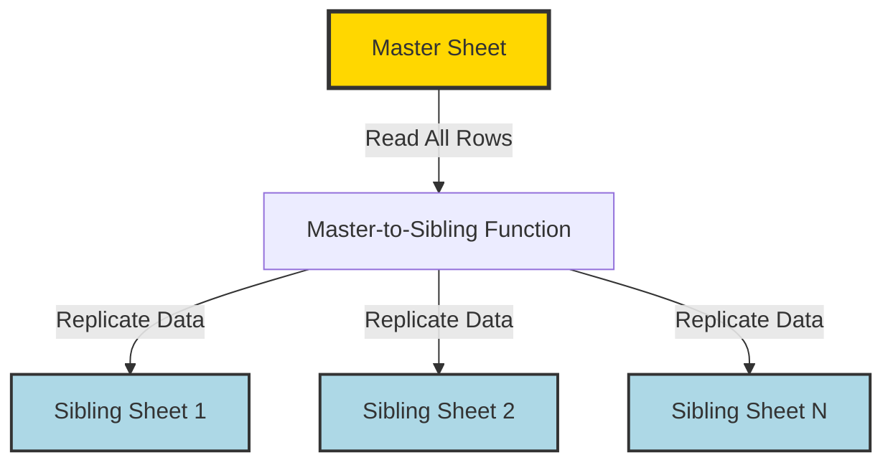
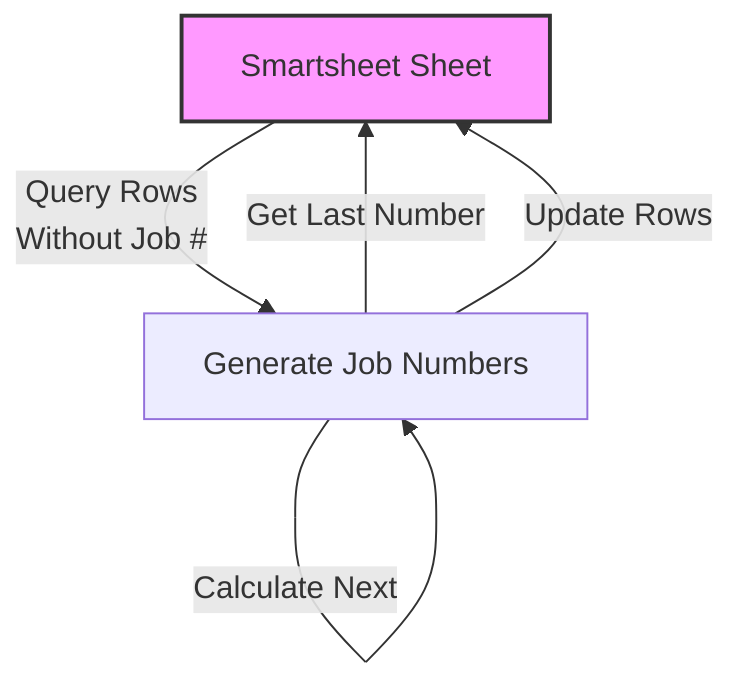
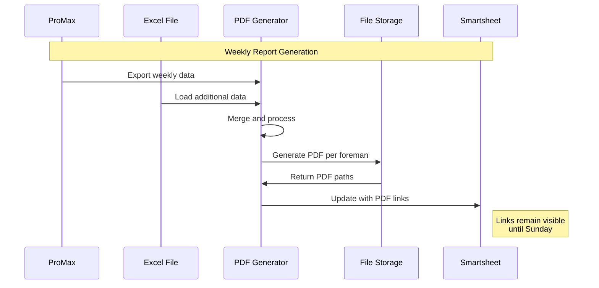

# Smartsheet Integration Details

This page documents the Smartsheet dependencies, data flows, and column mappings used across all integration repositories.

## Smartsheet Dependencies Overview

Each repository interacts with Smartsheet in different ways. Understanding these dependencies is crucial for maintenance and troubleshooting.

### Repository Dependencies Table

| Repository | Sheets Used | Operations | Column Dependencies |
|-----------|-------------|------------|---------------------|
| **Supabase-Smartsheet-Offload** | Multiple (configured) | Read from Supabase → Write to Smartsheet | Dynamic based on config |
| **Smartsheet-Supabase-Sync** | Multiple (configured) | Read from Smartsheet → Write to Supabase | Dynamic based on config |
| **Master-to-Sibling** | 1 Master + N Siblings | Read Master → Write Siblings | Mapped columns |
| **Generate-Job-Numbers** | 1 Target sheet | Read rows → Update with job numbers | Job number column |
| **Generate-Weekly-PDFs** | 1 Report sheet | Write PDF links and metadata | PDF URL, date columns |
| **Resiliency-PDF-Restructure** | 1 Validation sheet | Write validation results | CU code, status columns |

## Data Flow Diagrams

### Bidirectional Sync Pattern



### Master-Sibling Replication



### Job Number Assignment Flow



### Weekly PDF Generation Flow



## Column Mapping Reference

### Standard Column Types

Most repositories use similar column patterns:

#### Common Column Types

| Purpose | Example Name | Data Type | Required |
|---------|--------------|-----------|----------|
| Unique ID | Row ID, Job ID | TEXT_NUMBER | Yes |
| Name/Title | Job Name, Project Name | TEXT_NUMBER | Yes |
| Status | Status, State | PICKLIST | Optional |
| Date | Created Date, Updated Date | DATE | Optional |
| Owner | Assigned To, Owner | CONTACT_LIST | Optional |
| Description | Description, Notes | TEXT_NUMBER | Optional |

### Repository-Specific Mappings

#### Supabase-Smartsheet-Offload

Maps Supabase table columns to Smartsheet columns:

```python
# Example configuration
COLUMN_MAPPINGS = {
    'supabase_column': 'SMARTSHEET_COLUMN_ID',
    'id': 1234567890123456,
    'name': 2345678901234567,
    'status': 3456789012345678,
    'created_at': 4567890123456789,
}
```

**Normalization Rules:**
- Dates: Convert ISO 8601 to Smartsheet date format
- Booleans: Convert to "Yes"/"No" or checkboxes
- Null values: Convert to empty strings
- Numbers: Preserve as-is

#### Smartsheet-Supabase-Sync

Maps Smartsheet columns to Supabase columns:

```typescript
// Example configuration
const columnMapping = {
  'Column Name': 'supabase_column',
  'Job ID': 'job_id',
  'Job Name': 'job_name',
  'Status': 'status',
  'Created': 'created_at',
};
```

**Normalization Rules:**
- Contact columns: Extract email address
- Date columns: Convert to ISO 8601
- Checkbox columns: Convert to boolean
- Picklist: Store as string

#### Master-to-Sibling

Copies specific columns from master to siblings:

```python
# Columns to replicate
REPLICATED_COLUMNS = [
    'COLUMN_ID_NAME',      # 1234567890123456
    'COLUMN_ID_STATUS',    # 2345678901234567
    'COLUMN_ID_DATE',      # 3456789012345678
]
```

#### Generate-Job-Numbers

Requires only the job number column:

```python
COLUMN_ID_JOB_NUMBER = 1234567890123456  # Where to write numbers
STARTING_NUMBER = 1000  # First job number
```

#### Generate-Weekly-PDFs

Requires PDF link and metadata columns:

```python
COLUMN_ID_PDF_URL = 1234567890123456      # PDF link
COLUMN_ID_FOREMAN = 2345678901234567      # Foreman name
COLUMN_ID_WEEK_START = 3456789012345678   # Week start date
COLUMN_ID_WEEK_END = 4567890123456789     # Week end date
```

#### Resiliency-PDF-Restructure

Requires validation result columns:

```python
COLUMN_ID_CU_CODE = 1234567890123456          # Extracted CU code
COLUMN_ID_VALIDATION_STATUS = 2345678901234567 # Pass/Fail
COLUMN_ID_VALIDATION_DATE = 3456789012345678   # Validation timestamp
```

## Handling Smartsheet Changes

### When Column Names Change

!!! danger "Breaking Change"
    Renaming columns doesn't change column IDs, but it can break code that uses column names instead of IDs.

**Impact**: None if using column IDs. High if using column names.

**Action Required**:
1. Update any code using column names
2. Update documentation
3. No need to update column ID references

### When Column IDs Change

!!! danger "Critical Change"
    Column IDs rarely change, but when they do (sheet recreation, API bugs), all integrations break.

**Impact**: Complete failure of integrations.

**Action Required**:
1. Fetch new column IDs using API or script
2. Update all `.env` files with new IDs
3. Update configuration files
4. Test thoroughly before deploying
5. Document the change

**Script to Get Column IDs**:
```python
import smartsheet
import os

client = smartsheet.Smartsheet(os.environ['SMARTSHEET_ACCESS_TOKEN'])
sheet_id = 'YOUR_SHEET_ID'

sheet = client.Sheets.get_sheet(sheet_id)
print(f"\nColumn IDs for sheet: {sheet.name}")
print("-" * 50)
for column in sheet.columns:
    print(f"{column.title}: {column.id}")
```

### When Columns Are Added

**Impact**: Low to None (existing integrations unaffected).

**Action Required**:
1. If new column should be synced, update column mappings
2. Update Supabase schema if applicable
3. Redeploy affected integrations

**Example Addition**:
```python
# Add to .env
COLUMN_ID_NEW_FIELD=9876543210987654

# Add to mapping
COLUMN_MAPPINGS = {
    # ... existing mappings ...
    'new_field': 9876543210987654,
}
```

### When Columns Are Removed

!!! warning "Potential Break"
    If the removed column is used by integrations, they will fail.

**Impact**: High if column is mapped; None otherwise.

**Action Required**:
1. Remove column from mappings
2. Remove column from database schema (if Supabase)
3. Update queries that reference the column
4. Test thoroughly

### When Sheet IDs Change

!!! danger "Critical Change"
    Sheet IDs change when sheets are copied or recreated. This breaks all integrations.

**Impact**: Complete failure.

**Action Required**:
1. Update `SHEET_ID` in all `.env` files
2. Update GitHub Actions secrets
3. Update systemd service files
4. Update documentation
5. Test all integrations

### When Sheet Structure Changes

**Examples**: Adding sections, changing hierarchy, formula columns

**Impact**: Varies by change.

**Action Required**:
1. **Sections**: Usually no impact on API operations
2. **Hierarchy**: May affect row parent/child relationships
3. **Formula columns**: Cannot be written via API (read-only)
4. **Dependencies**: May affect automation behavior

## API Rate Limiting

### Smartsheet API Limits

| Tier | Rate Limit | Notes |
|------|------------|-------|
| **Standard** | 300 requests/minute | Per access token |
| **Enterprise** | Higher limits | Contact Smartsheet |
| **Bulk Operations** | Counted as 1 request | Use when possible |

### Best Practices

1. **Use Bulk Operations**: Update multiple rows in one request
   ```python
   # Good: Bulk update
   client.Sheets.update_rows(sheet_id, rows)
   
   # Bad: Individual updates
   for row in rows:
       client.Sheets.update_rows(sheet_id, [row])
   ```

2. **Implement Retry Logic**: Handle rate limit errors (429)
   ```python
   import time
   from smartsheet.exceptions import ApiError
   
   def update_with_retry(client, sheet_id, rows, max_retries=3):
       for attempt in range(max_retries):
           try:
               return client.Sheets.update_rows(sheet_id, rows)
           except ApiError as e:
               if e.error.result.status_code == 429:
                   wait_time = 60  # Wait 1 minute
                   time.sleep(wait_time)
               else:
                   raise
   ```

3. **Batch Requests**: Combine operations when possible
4. **Cache Data**: Avoid repeated reads of the same data
5. **Schedule Wisely**: Distribute load across time

## Data Normalization Guidelines

### String Fields

- **Trim whitespace**: `value.strip()`
- **Handle nulls**: Convert `None` to empty string `""`
- **Encoding**: Ensure UTF-8 encoding
- **Max length**: Check Smartsheet limits (varies by column type)

### Date Fields

**From Smartsheet to Database**:
```python
from datetime import datetime

# Smartsheet date format: "2025-01-15"
smartsheet_date = "2025-01-15"
db_date = datetime.fromisoformat(smartsheet_date)
```

**From Database to Smartsheet**:
```python
from datetime import datetime

db_date = datetime.now()
smartsheet_date = db_date.strftime("%Y-%m-%d")
```

### Number Fields

```python
# Handle various input types
def normalize_number(value):
    if value is None:
        return 0
    try:
        return float(value)
    except (ValueError, TypeError):
        return 0
```

### Boolean Fields

**Checkbox columns** (Smartsheet):
```python
# To Smartsheet
bool_value = True
smartsheet_value = True  # Direct boolean

# From Smartsheet
smartsheet_value = True
bool_value = bool(smartsheet_value)
```

**Text representation**:
```python
def bool_to_text(value):
    return "Yes" if value else "No"

def text_to_bool(value):
    return value.upper() in ["YES", "Y", "TRUE", "1"]
```

### Contact List Fields

```python
# Extract email from contact column
def extract_email(contact_column):
    if isinstance(contact_column, dict):
        return contact_column.get('email', '')
    return str(contact_column)
```

## Troubleshooting Data Issues

### Common Issues

1. **Column ID Mismatch**: Check column IDs in sheet vs. config
2. **Type Mismatch**: Ensure data types match column types
3. **Required Fields**: Fill all required columns
4. **Formula Columns**: Cannot write to formula columns
5. **Locked Columns**: Check column permissions

### Validation Checklist

Before deploying changes:

- [ ] Verify all column IDs are correct
- [ ] Test with a single row first
- [ ] Check data type compatibility
- [ ] Validate date formats
- [ ] Test null/empty value handling
- [ ] Verify bulk operation success
- [ ] Check error logs
- [ ] Monitor API rate limits

## Next Steps

- **[Watch Out For](watch-out-for.md)** - Critical pitfalls and risks
- **[Maintenance Guide](maintenance-guide.md)** - How to update configurations
- **[Troubleshooting](troubleshooting.md)** - Debug common issues
